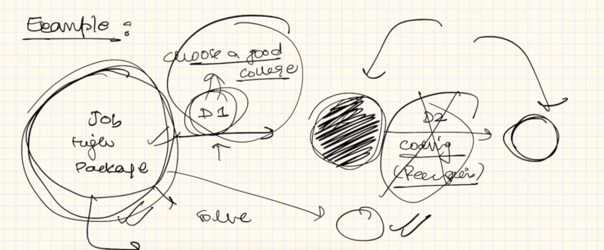
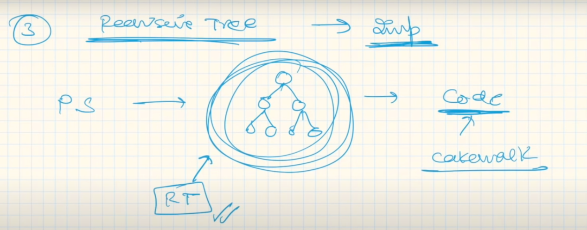
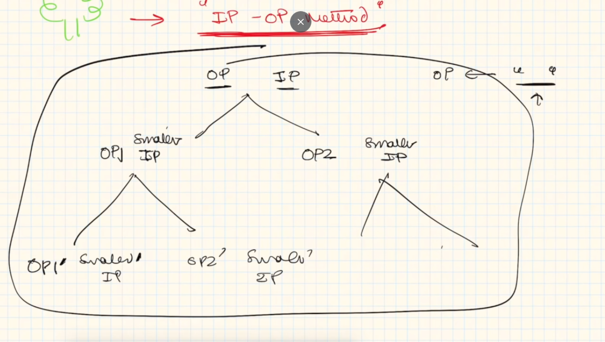

# Recursion

## Key-Points:
1. Make Input Smaller (Input gets smaller automatically). How ?
	- The main point is, we perform a task, where we take a decision, and as a result our Input gets smaller. 
	- Example: We need Job, but how ? Select a good college > Learn coding etc
	
	-  Our primary goal is to take the decisions and out input will get small automatically. 
	<br>
2.  Recusrion - Decision Phase
	- Choices are Given + Decision will be taken.
<br>	
3.  Recursive Tree [M.Imp]  <br/>

	 
	- 

### How to identify a Problem can be solved with Recursion ?
You will be given some choices, out of which you'll have to "DECIDE" one of the option. All you have to do is to make a decision whether to include or exculde the option.

### Recursive Tree
You can follow Input-Output Method.
Example:

-  Number of Branches = Number of Choices.
-  Decision we take is represented using Recursive Tree.
-  

### Example:
All Subsets Possible out of abc.
Input: "abc"
 

---

## Recursion is Everywhere!!
Recursion is used in: 
- Graphs,
- Tree
- Array & Strings
- Dynamic Programming
- Backtracking
- Data Structures etc

## Problems Based on Recursion:
1. Input Output Methods
	- [Print 1 to n / n to 1](Codes/print-1-n.cpp)
	- Sort an array / Sort a Stack
	- Delete the middle Element of Stack
	- Removal of Duplicates from a string
	- Counting Number of Occurences
	- Subset Problem
	- Josephus Problem
	- Permutation of Spaces 
2. Extended Input Output Method

	- Binary String Generation (Like Num of 1 > Num of 0)
	- Generate Balanced Parenthese

----

## Hypothesis
1. Base Condition
	- Smallest Valid Input
	- or Smallest Invalid Input

<b>Step 1: Design hypothesis</b>

```cpp
//Using Math Induction, if print(n) prints till n, print(n-1) will print upto (n-1). i.e.
print(7) = 1,2,3,4,5,6,7
print(6) = 1,2,3,4,5,6
```

<b> Step 2: Induction </b>
It is the most Important Step for a recursion.
We have got print(n), we will simple call print(n-1),
```cpp
// Calling Print(n-1)
print(n-1);
cout<<n<<",";
```

<b> Step 3: Base Condition</b>
According to question, we will find the Minimum value, and put it in the base condition. (Smallest Valid Input)
```cpp
if(n==1)
	return 1;
```

Tip: Attempt to check the Recursion for n and (n-1) input only.

---
### How does Hypothesis & Induction works ?
We define a function in Hypothsis and creates its signature.
for eg. In a Program to print 1-n 
```cpp
print(n) ---> will print 1 to N
print(n-1) ---> will print 1 to N-1
```
Now in Induction step, we will have to simply call
```cpp
void print(n)
{
	if(n==1)
	cout<<n<<" ";
	return 1;
}
print(n-1);

```

<b>Conclusion: </b>
You can design your hypothesis anyhow, but you can change the whole working of the function by just modifing the Induction.

<b>Approach to Solve any Recursion Problem :</b>
1. Observe the Problem Statement, look for the Input & Output.
2. Design the Induction ,Base Condition, Hypothesis
3. Write the Code.

